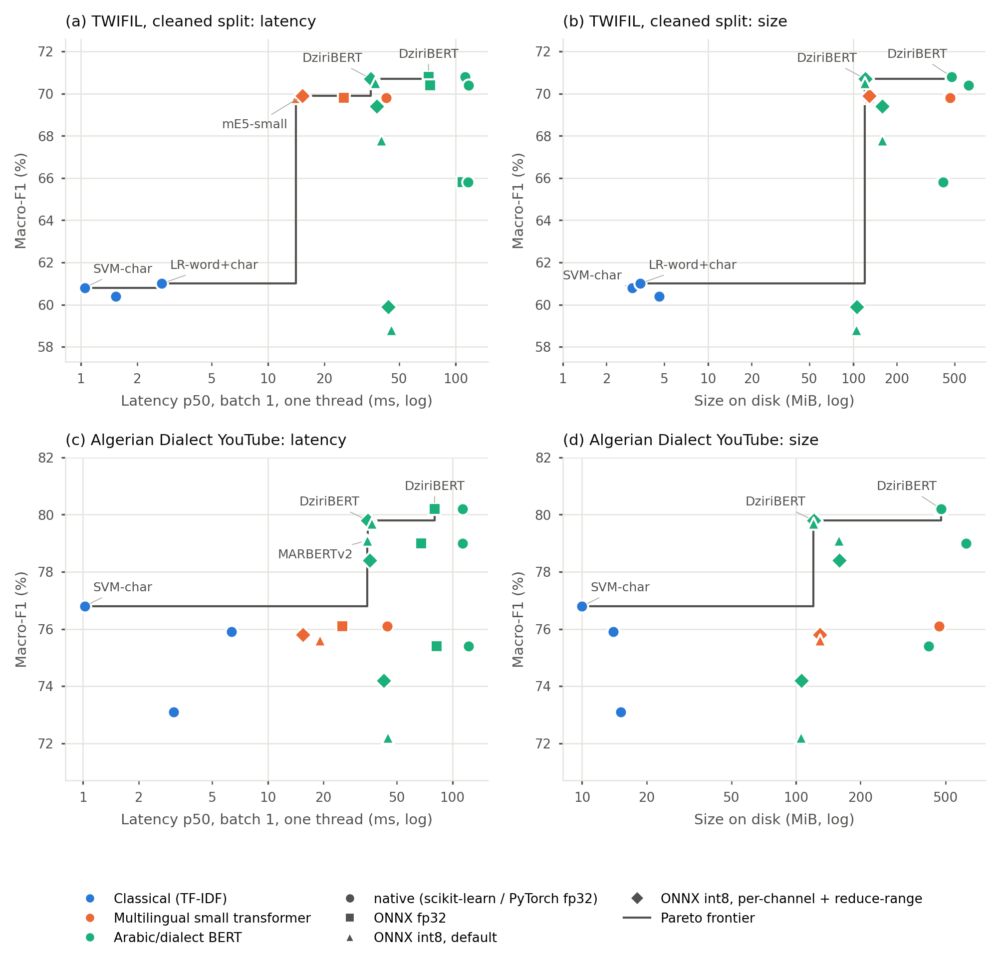

# Accuracy Is Not Enough: A Deployment-Aware Benchmark of Algerian Dialect Sentiment Classifiers for CPU Inference

Code, data splits and raw results for the paper *Accuracy Is Not Enough: A Deployment-Aware Benchmark of Algerian Dialect Sentiment Classifiers for CPU Inference* (submitted to *Review of Computer Engineering Research*).

The study measures classification quality and deployment cost **on the same artefacts**. Three TF-IDF classifiers and four
pre-trained transformers (DziriBERT, MARBERTv2, CAMeLBERT-DA, multilingual-e5-small) are trained on three public Algerian
datasets after an audit that removes empty, contradictory, duplicated and leaked items. The transformers are exported to
ONNX at fp32 and int8 precision, and every artefact is benchmarked in a fresh process on one CPU thread for size on disk,
peak memory, cold start and latency, together with its macro-F1 on the full test set.

## Main results

One CPU thread, single-comment latency; the benchmarked artefact is the first-seed model. Full tables are in
[`results/tables/`](results/tables/).

| Dataset | Model | Format | Macro-F1 (%) | Size (MiB) | Peak RSS (MiB) | p50 (ms) | p95 (ms) |
|---|---|---|---:|---:|---:|---:|---:|
| TWIFIL (cleaned) | SVM-char | scikit-learn | 60.8 | 3.0 | 204 | 1.05 | 1.45 |
| TWIFIL (cleaned) | LR-word+char | scikit-learn | 61.0 | 3.4 | 206 | 2.71 | 3.93 |
| TWIFIL (cleaned) | DziriBERT | PyTorch fp32 | 70.8 | 475.9 | 891 | 112.2 | 206.7 |
| TWIFIL (cleaned) | DziriBERT | ONNX int8 (per-channel + RR) | 70.7 | 121.0 | 258 | 35.4 | 77.4 |
| TWIFIL (cleaned) | mE5-small | ONNX int8 (per-channel + RR) | 69.9 | 129.3 | 474 | 15.2 | 33.2 |
| Algerian Dialect YouTube | SVM-char | scikit-learn | 76.8 | 10.0 | 261 | 1.02 | 1.62 |
| Algerian Dialect YouTube | LR-word+char | scikit-learn | 75.9 | 14.0 | 304 | 6.37 | 8.72 |
| Algerian Dialect YouTube | DziriBERT | PyTorch fp32 | 80.2 | 475.9 | 903 | 113.3 | 266.1 |
| Algerian Dialect YouTube | DziriBERT | ONNX int8 (per-channel + RR) | 79.8 | 121.0 | 262 | 34.8 | 119.1 |
| Algerian Dialect YouTube | mE5-small | ONNX int8 (per-channel + RR) | 75.8 | 129.3 | 474 | 15.5 | 50.5 |



## Repository layout

```
notebooks/
  01_data_preparation.ipynb       data download, cleaning, audit and splits (Colab, CPU)
  02_models_and_benchmark.ipynb   training, ONNX export, int8 quantisation, CPU benchmark, report tables
data/
  splits/<dataset>/{train,dev,test}.csv     ids and labels of every split (all datasets)
  processed/<dataset>/{train,dev,test}.csv  cleaned text (TWIFIL cleaned and YouTube only)
  audit/                                    dataset statistics, audit counts, per-item removal log
results/
  tables/        all result tables (CSV and Markdown) as written by notebook 02
  provenance/    library versions, hardware, configuration and raw-file hashes of each run
  figures/       the two figures of the paper
scripts/
  make_figures.py    regenerates results/figures/ from results/tables/table_deployment.csv
  paper_numbers.py   derives the ratios, ranges and gaps quoted in the paper (writes results/paper_numbers.json)
MANIFEST.sha256      SHA-256 checksum of every file
```

## Data

| Folder name | In the paper | Train / dev / test | Included here | Source and licence |
|---|---|---|---|---|
| `twifil_official` | TWIFIL, DziriBERT split | 6,369 / 708 / 2,360 | ids and labels | Moudjari et al. (LREC 2020), as distributed with DziriBERT (commit `8d6959c`); CC BY-NC-SA 4.0 |
| `twifil_clean` | TWIFIL, cleaned | 4,998 / 556 / 1,942 | ids, labels, cleaned text | derived from the above; CC BY-NC-SA 4.0 |
| `youtube` | Algerian Dialect YouTube | 35,928 / 4,491 / 4,491 | ids, labels, five-level label, video id, cleaned text | Benmounah, Mendeley Data V2, doi:10.17632/zzwg3nnhsz.2; CC BY 4.0 |
| `narabizi` | NArabizi, 3 classes | 755 / 97 / 113 | ids and labels | Touileb and Barnes (Findings of ACL 2021), github.com/SamiaTouileb/Narabizi |
| `narabizi_4class` | NArabizi, 4 classes | 997 / 137 / 144 | ids and labels | as above |

Labels: `0` negative, `1` neutral, `2` positive (`3` mixed in `narabizi_4class`). The folder name `twifil_official` is kept
because the code uses it; the paper calls this split *the DziriBERT split*, since it was published by the DziriBERT authors
rather than with TWIFIL itself. Texts that are not included here are rebuilt by notebook 01 from the original sources at
pinned versions. See [`data/README.md`](data/README.md) for the id schemes and columns, and
[`DATA_LICENSES.md`](DATA_LICENSES.md) for the licences.

**Link-only tweets.** 1,312 of the 9,437 tweets in the DziriBERT split (13.9%) contain no Arabic or Latin letter, emoji or
emoticon once links and mentions are removed (1,210 consist of links and mentions alone, 80 of punctuation or digits, 22 of
text in other scripts); 1,283 of them are labelled neutral. They are listed in
[`data/audit/removed_items.csv`](data/audit/removed_items.csv) together with every other item removed by the audit.

## Reproducing the results

1. **Data.** Open `notebooks/01_data_preparation.ipynb` in Google Colab (CPU runtime). Download the YouTube dataset from
   Mendeley Data (doi:10.17632/zzwg3nnhsz.2) into `MyDrive/alg_sentiment_benchmark/raw/youtube/` and run all cells. The
   notebook clones the DziriBERT and NArabizi repositories at fixed commits, writes `processed/` and `reports/`, and
   records the SHA-256 of every raw file.
2. **Models and benchmark.** Open `notebooks/02_models_and_benchmark.ipynb` with `RUN_STAGES = "auto"`. On a T4 GPU
   runtime it fine-tunes the transformers (stage B, three seeds); on a CPU runtime it trains the classical models,
   exports and quantises the transformers, runs the benchmark and writes the tables (stages A, C, D and E). Run the whole
   benchmark in one runtime type so that every artefact sees the same processor.
3. **Figures and quoted numbers.** From the repository root:
   `pip install pandas numpy matplotlib && python scripts/make_figures.py && python scripts/paper_numbers.py`.

Benchmark environment (from `results/provenance/provenance_02_benchmark.json`): Intel(R) Xeon(R) CPU @ 2.20GHz, CPU flags
avx2 (no AVX-512, no VNNI); Python 3.13.15, PyTorch 2.11.0+cpu, Transformers
5.17.0, ONNX Runtime 1.30.0, scikit-learn 1.6.1. Absolute times describe this
machine only; ratios between artefacts and the size and memory figures are the robust part of the results.

## Measurement notes

- Latency (p50, p95), cold start and peak RSS are medians over four passes: a main pass (300 texts × 3 rounds after 20
  warm-up calls, then the full test set in batches of 32) and three timing-only passes (200 texts, 10 warm-up calls, no
  batch prediction). Peak RSS therefore describes single-comment serving. ONNX fp32 was measured in one pass only, so its
  peak RSS also covers the batch prediction.
- Sizes and memory are in mebibytes (MiB, 2^20 bytes), although the CSV column headers say MB.
- Main-pass values of all artefacts except the per-channel, reduce-range models come from an earlier session and are kept
  in `results/tables/table_deployment_mainpass_earlier_run.csv` (its `ONNX int8 per-channel` rows are the variant without
  reduce-range).
- Rows labelled `ONNX int8 per-channel (no RR)` are a misconfiguration reported for transparency: on this processor two
  models collapse to constant predictions.
- The YouTube split is stratified on the five-level label but not grouped by video; the `video` column allows grouped
  splits.

## Citation

Please cite the paper (see [`CITATION.cff`](CITATION.cff); the full reference will be added after publication) and the
original datasets listed above.

## Licence

Code and notebooks: MIT ([`LICENSE`](LICENSE)). Data files keep the licences of the corpora they derive from
([`DATA_LICENSES.md`](DATA_LICENSES.md)).

## Acknowledgements

We thank the creators of TWIFIL, NArabizi and the Algerian Dialect YouTube corpus, and the authors of DziriBERT, for making
their data and code publicly available.
